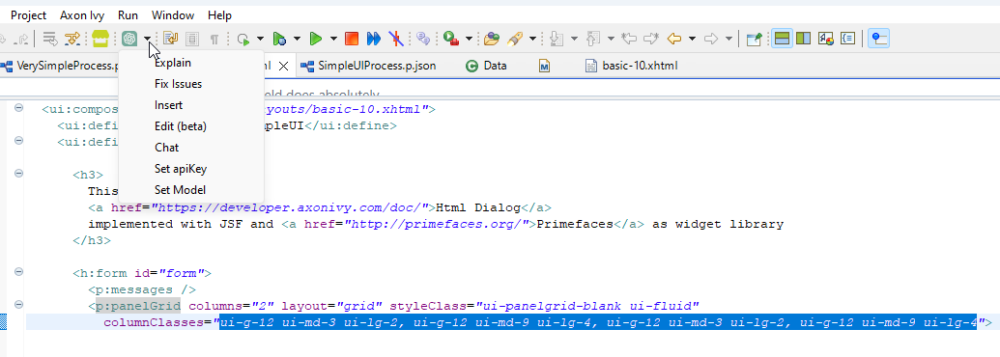
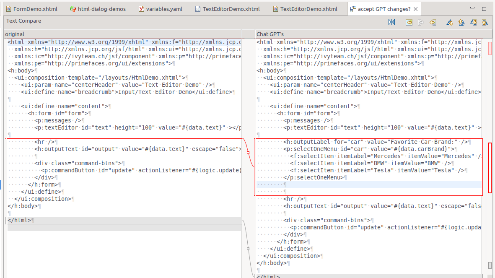
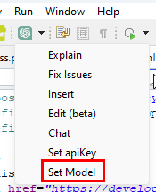
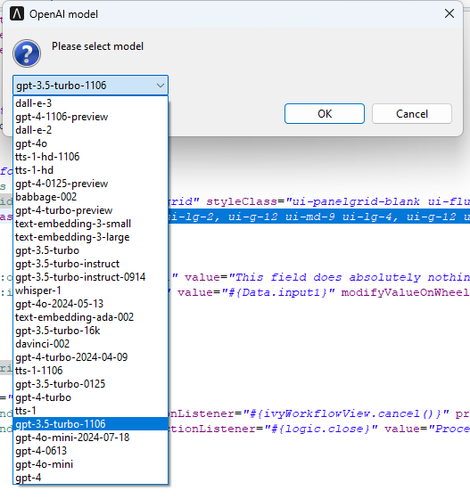

# ChatGPT Code Assistant

Axon Ivy's ChatGPT Code Assistant is an integration of the OpenAI API into the Axon Ivy Designer. The assistant provides a context menu that allows you to use AI to explain, fix or add code.  

This connector:
- is based on the OpenAI API platform platform.openai.com.
- extends your existing Axon Ivy Designer IDE.
- requires an API key from the OpenAI API.
- supports you in the development of business processes by 
    - explaining code snippets, 
    - correcting erroneous code, 
    - inserting new instructions, 
    - answering questions about your code 
    - and adding new BPMN elements.


## Demo

The assistant context menu:


Supports you in reviews, by explaining existing code:


Accepts insert or change code change requests in natural language:


Allows you to select and apply the changes you were asking for:


The OpenAI API offers the option of using various models. Note, however, that some of them are not suitable for text output (e.g. 'dall-e' -> images or 'whisper' -> audio). 
Usable for this ChatGPT code assistant are all models, starting with gpt*, but quality and pricing is very different: https://platform.openai.com/docs/models





## Setup

1. Install this Dropin extension by pressing the 'install' button in the market.
2. After installing, reboot the Designer, as advised by the dropin-installer.
3. Setup the OpenAI API key

### OpenAI API key

ChatGPT requests do not come for free. However, when you register a new account,
 5$ are automatically added to it. This is perfect to develop your ChatGPT integration free of charge.

1. Register an account on [platform.openai.com](https://platform.openai.com/overview).
2. Once logged in, click on your user icon on the upper right corner.
3. In the menu, use the "View API keys" option.
4. Generate a new API key
5. Open a Designer where the openai-assistant was installed.
6. Right click into a code editor: select `ChatGPT assistant` > `Set apiKey` > fill in your secret key.

### Customization

The OpenAI assistant uses the designer app.yaml to load custom settings.
The following keys are valid and interpreted:

```
@variables.yaml@
```
