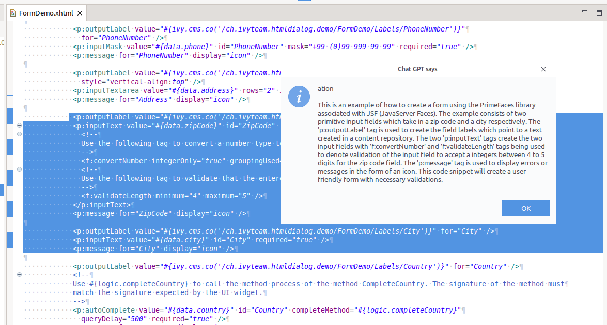

## Unterstützung für Entwickler: der ChatGPT Assistent

Axon Ivys **ChatGPT-Assistent** ist eine Anpassung der OpenAI API für die Integration in den Axon Ivy Designer. Der Assistent liefert ein Kontextmenü, mit der dir KI-gestützt Code erklärt, gefixt oder hinzufügt werden kann.

Dieser Assistent:

- Basiert auf der OpenAI-API-Plattform 'platform.openai.com'.
- Erweitert deine bestehende Axon Ivy Designer IDE.
- Benötigt einen API-Schlüssel von der OpenAI API.
- Unterstützt dich bei der Entwicklung von Geschäftsprozessen, indem er 
    - Code-Snippets erklärt, 
    - fehlerhaften Code korrigiert, 
    - neue Anweisungen einfügt, 
    - Fragen zu deinem Code beantwortet 
    - und neue BPMN-Elemente hinzufügt.


## Demo

The assistant context menu, popping up in all code-editors:


Supports you in reviews, by explaining existing code:


Accepts insert or change code change requests in natural language:


Allows you to select and apply the changes you were asking for:


## Setup

1. Install this Dropin extension by pressing the 'install' button in the market.
2. After installing, reboot the Designer, as advised by the dropin-installer.
3. Setup the OpenAI API key

### OpenAI API key

ChatGPT requests do not come for free. However, when you register a new account,
 5$ are automatically added to it. This is perfect to develop your ChatGPT integration free of charge.

1. Register an account on [platform.openai.com](https://platform.openai.com/overview).
2. Once logged in, click on your user icon on the upper right corner.
3. In the menu, use the "View API keys" option.
4. Generate a new API key
5. Open a Designer where the openai-assistant was installed.
6. Right click into a code editor: select `ChatGPT assistant` > `Set apiKey` > fill in your secret key.

### Customization

The OpenAI assistant uses the designer app.yaml to load custom settings.
The following keys are valid and interpreted:

```
@variables.yaml@
```

